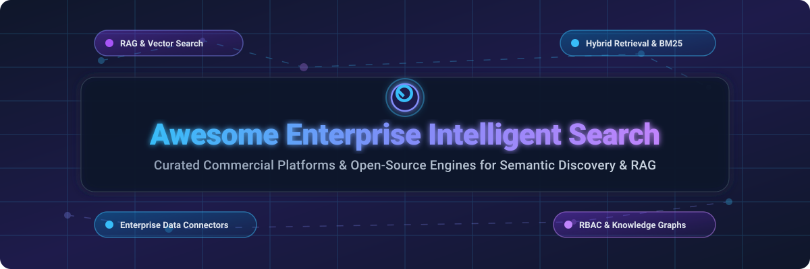

# Awesome-Enterprise-Intelligent-Search 🔍 🏢

  

  
  
  
  
  
  

---

## 🌟 Top Enterprise Intelligent Search Ecosystem & Software Directory

**Curated List of Commercial Enterprise Search Platforms & Open-Source Search Engines**  
*Focused on Semantic Search, Vector Retrieval, RAG Pipelines, Knowledge Graphs, Permissions-Aware Connectors & Self-Hosted Infrastructure* 🚀

**Last updated: October 2026** 📅

---

### 📌 Overview & SEO Summary

Welcome to the definitive curated directory of **enterprise intelligent search platforms**, **open-source search engines**, and **semantic retrieval frameworks**. Modern enterprise intelligent search leverages **hybrid retrieval (BM25 keyword search + vector embeddings)**, **Retrieval-Augmented Generation (RAG)**, **enterprise data connectors** (Slack, Jira, Confluence, Salesforce, SharePoint), and **role-based security access control (RBAC)** to enable instant knowledge discovery across structured and unstructured enterprise data.

Whether you are looking for enterprise-grade commercial solutions (such as *Microsoft Copilot Search*, *Amazon Kendra*, *Glean*, and *Elastic Enterprise Search*), or self-hostable open-source alternatives (like *Open WebUI*, *Elasticsearch*, *Meilisearch*, *Milvus*, *Qdrant*, and *OpenSearch*), this guide provides comprehensive technical details, specific pricing tiers, free tier limits, and GitHub stargazers rankings. 💡

**Key Market Context:**
- 📈 **Market Size & Structure**: The global Enterprise Search and Intelligent Knowledge Discovery market is valued at **~$6.5 Billion (2026)** and is projected to expand at a **CAGR of 18.5%**, reaching **$14.2 Billion by 2030**. The sector is **moderately fragmented**, with cloud hyperscalers (Microsoft, AWS) dominating core cloud infrastructures while specialized AI search innovators (Glean, AlphaSense, Hebbia) capture high-value enterprise knowledge workflows.
- ⚡ **Elasticsearch & OpenSearch** remain the **dominant open-source search engine foundations**, powering **millions of applications** with **vector search, hybrid retrieval, and enterprise RAG pipelines**.
- 🎯 **Glean & Microsoft Copilot** represent the **leading commercial AI assistant and search platforms**, featuring **100+ native connectors**, **knowledge graphs**, and **strict permissions-aware retrieval**.
- 🚀 **Meilisearch & Typesense** deliver **instant sub-50ms developer-friendly search**, serving as modern open-source alternatives for web app search and e-commerce retrieval.

---

## 📑 Table of Contents

- [🏢 SaaS & Commercial Platforms](#-saas--commercial-platforms)
- [🔓 Open-Source GitHub Projects](#-open-source-github-projects)
- [🛠️ How to Contribute](#%EF%B8%8F-how-to-contribute)
- [📊 Star History](#-star-history)
- [🤝 Support & Sponsorship](#-support--sponsorship)
- [⚠️ Disclaimer](#%EF%B8%8F-disclaimer)

---

## 🏢 SaaS / Commercial Platforms

The enterprise intelligent search SaaS market estimated size is **~$6.5 Billion**, displaying a **moderately fragmented** structure where cloud hyperscalers (Microsoft, Amazon) provide broad workplace integration while specialized category leaders (Glean, AlphaSense, Coveo) offer deep industry-specific knowledge graph synthesis.

| SaaS / Commercial Platform | Company / Owner | Valuation / Market Cap | Standard Edition Starting Price | Free Tier / Free Trial Limits | Description |
| :--- | :--- | :--- | :--- | :--- | :--- |
| **[Microsoft Copilot Search](https://www.microsoft.com/en-us/microsoft-365/copilot)** 🔷 | Microsoft | ~$3.90 Trillion | **$30.00/user/month** (Microsoft 365 Copilot annual commit) | **No free tier**; 30-day enterprise trial available for qualified M365 tenants | **Microsoft-native intelligent search** — **Integrated with Microsoft 365, SharePoint, and Teams** . **Grounding in Microsoft Graph with RBAC** . **Natural language search across enterprise data** . 🏢 |
| **[Amazon Kendra](https://aws.amazon.com/kendra/)** ☁️ | Amazon | ~$2.0 Trillion | **$1.125/hour** ($810/month Developer Edition) + **$0.25/1,000 queries** | **Free tier: 750 hours for 30 days** (up to 10,000 documents & 4,000 queries) | **AWS-native intelligent search** — **ML-powered search across enterprise data** . **40+ connectors** for S3, SharePoint, Salesforce, and OneDrive . **Natural language queries with precise answer extraction** . ☁️ |
| **[Elastic Enterprise Search](https://www.elastic.co/enterprise-search)** 🔵 | Elastic N.V. | ~$10 Billion | **$95.00/month** (Elastic Cloud Standard deployment) | **Free: 14-day trial** (full features on Elastic Cloud, no credit card required) | **Enterprise search built on Elasticsearch** — **Workplace Search, App Search, and Site Search** . **Vector search, hybrid retrieval, and RAG pipelines** . ⚡ |
| **[Glean](https://www.glean.com/)** 🎯 | Glean | ~$4.6 Billion | **$50.00/user/month** (Enterprise plan starting at ~$50,000/year min commit) | **No free tier**; custom guided sandbox demo available upon request | **Enterprise search and AI assistant** — **100+ native connectors** for enterprise software . **Knowledge graph with permissions-aware retrieval** . **Glean Assistant, Chat, and AI Agents** . 🎯 |
| **[AlphaSense](https://www.alpha-sense.com/)** 📈 | AlphaSense | ~$4 Billion | **$300.00/user/month** ($3,600/year per seat enterprise subscription) | **Free: 14-day trial** (includes access to SEC filings, transcripts, and market research) | **Market intelligence search** — **Financial documents, earnings calls, and expert interviews** . **AI-powered sentiment analysis for finance and consulting** . 📈 |
| **[Algolia](https://www.algolia.com/)** ⚡ | Algolia | ~$2.25 Billion | **$0.50/1,000 search requests** ($1/month Grow plan minimum) | **Free tier: 10,000 search requests/month** (forever free with 100K records) | **Developer-first search API** — **Sub-50ms search latency** . **Vector search, NeuralSearch, and AI-powered relevance** . **The most developer-friendly search platform** . ⚡ |
| **[Coveo Relevance Cloud](https://www.coveo.com/)** 🟢 | Coveo | ~$500 Million | **$1,500.00/month** (Pro plan base commitment) | **Free: 30-day trial** (includes developer sandbox & trial index) | **AI-powered relevance platform** — **Unified search across enterprise data** . **Machine learning-driven relevance and personalization** . **The leading enterprise commerce & service search platform** . 🟢 |
| **[Hebbia](https://www.hebbia.com/)** 🧠 | Hebbia | Private (~$700M) | **$200.00/user/month** ($2,400/year standard user tier) | **No free tier**; 14-day evaluation sandbox for enterprise teams | **AI research and analysis platform** — **Matrix** for **document-heavy workflows** in finance, legal, and private equity . **Multi-document synthesis and tabular extraction** . 🧠 |
| **[Lucidworks Fusion](https://lucidworks.com/)** 🟣 | Lucidworks | Private (~$370M) | **$2,500.00/month** (Enterprise starter subscription) | **Free: 30-day trial** (developer evaluation license for Fusion) | **AI-powered search platform** — **Built on Apache Solr** . **Hybrid search with vector and keyword retrieval** . **Highly customizable enterprise search platform** . 🟣 |
| **[Sinequa](https://www.sinequa.com/)** 🔷 | Sinequa | Private | **$3,500.00/month** (Enterprise core tier commitment) | **No free tier**; customized POC trial available for qualified enterprises | **Enterprise search and deep analytics** — **Unified search across 200+ enterprise data sources** . **NLP, neural search, and multi-lingual processing** . 🔷 |

---

## 🔓 Open-Source GitHub Projects

*Sorted by GitHub Stars Count (Descending)* 🌟

- **[Open WebUI](https://github.com/open-webui/open-webui)**  🔒  
  **Self-hosted ChatGPT-style UI with RAG**, MIT licensed. **124K+ GitHub stars** — **supports Ollama, OpenAI-compatible APIs, MCP servers, and RAG with 9+ vector databases** . **Multi-user RBAC and LDAP/SSO integration** . **The most deployed self-hosted AI search interface** . 🚀

- **[Elasticsearch](https://github.com/elastic/elasticsearch)**  🔍  
  **Distributed, RESTful search and analytics engine**, Elastic License 2.0 / SSPL. **70K+ GitHub stars** — **the most widely deployed open-source search engine** . **Full-text search, vector search, BM25, and hybrid retrieval** . **Kibana visualization** . **The definitive open-source search foundation** . 🏛️

- **[Meilisearch](https://github.com/meilisearch/meilisearch)**  ⚡  
  **Lightning-fast open-source search engine**, MIT licensed. **50K+ GitHub stars** — **sub-50ms search latency** . **Typo-tolerant, instant search-as-you-type** . **Vector search and AI-powered hybrid retrieval** . **The most developer-friendly open-source search engine** . 🎯

- **[Milvus](https://github.com/milvus-io/milvus)**  🎯  
  **Cloud-native open-source vector database**, Apache-2.0 licensed. **35K+ GitHub stars** — **billion-scale vector similarity search** . **Designed for enterprise AI retrieval and RAG pipelines** . **The most scalable open-source vector database** . 🧠

- **[Qdrant](https://github.com/qdrant/qdrant)**  🧠  
  **High-performance open-source vector database**, Apache-2.0 licensed. **25K+ GitHub stars** — **vector similarity search with payload filtering** . **Rust-based engine for semantic search and RAG** . **The most performant open-source vector database** . ⚡

- **[Typesense](https://github.com/typesense/typesense)**  🎯  
  **Open-source, typo-tolerant search engine**, GPL-3.0 licensed. **22K+ GitHub stars** — **instant search with sub-50ms latency** . **C++ performance, vector search, and hybrid retrieval** . **The top open-source alternative to Algolia** . ⚡

- **[Onyx (formerly Danswer)](https://github.com/onyx-dot-app/onyx)**  🏢  
  **Open-source enterprise search and AI assistant**, MIT licensed. **15K+ GitHub stars** — **40+ connectors** for Slack, Google Drive, Confluence, Jira, Notion, and Web . **Generative RAG answers with verifiable citations** . **Self-hosted for complete enterprise data sovereignty** . 🌐

- **[Weaviate](https://github.com/weaviate/weaviate)**  🧩  
  **Open-source vector database with GraphQL API**, BSD-3-Clause licensed. **14K+ GitHub stars** — **vector search, hybrid keyword retrieval, and built-in ML modules** . **Flexible schema-driven semantic vector engine** . 🧩

- **[OpenSearch](https://github.com/opensearch-project/OpenSearch)**  🏛️  
  **Community-driven, Apache 2.0-licensed search suite**, Apache-2.0 licensed. **9K+ GitHub stars** — **AWS-backed open-source fork of Elasticsearch** . **Full-text search, k-NN vector search, and analytical dashboards** . **The most permissively licensed enterprise search engine** . ☁️

- **[Vespa](https://github.com/vespa-engine/vespa)**  🚀  
  **AI-powered search and recommendation engine**, Apache-2.0 licensed. **6K+ GitHub stars** — **real-time big-data search and neural ranking at scale** . **Vector search and tensor evaluation in production** . **Engineered by Yahoo for massive internet scale** . 🌐

- **[Apache Solr](https://github.com/apache/solr)**  🏛️  
  **Blazing-fast enterprise search platform**, Apache-2.0 licensed. **5K+ GitHub stars** — **the original enterprise search engine built on Apache Lucene** . **Full-text search, faceting, spatial search, and vector retrieval** . **The most battle-tested open-source search engine** . 🏛️

---

## 🛠️ How to Contribute

Contributions are welcome! Follow these steps to submit new enterprise search platforms or open-source search software: 🤝

1. 🍴 **Fork** the repository.
2. 📝 **Add/edit** entries in `README.md` maintaining table/list structure and formatting.
3. 🔗 Include project title, official website/GitHub link, exact Stars_Count badge, license, and brief description.
4. 🚀 Submit a **Pull Request** with a descriptive summary of your changes.

---

## 📊 Star History

---

## 🤝 Support & Sponsorship

Thank you so much for exploring and using this curated directory of enterprise intelligent search platforms! Your support helps keep this resource updated, accurate, and community-driven. 💖

If you find this repository useful, please consider supporting the project:
- ⭐ **Star** this repository on GitHub to help increase its visibility!
- 🔀 **Fork** and share it with fellow search engineers, data teams, and open-source advocates.
- ☕ **Buy Me a Coffee / Sponsor**: Support ongoing open-source curation and development via the [GitHub Sponsor Dashboard](https://github.com/sponsors/ishandutta2007). ☕

---

## ⚠️ Disclaimer

- This is a **community-curated** list — not exhaustive and not an official commercial endorsement. ℹ️
- **Elasticsearch and OpenSearch are the two dominant open-source search engines** — **Elasticsearch uses Elastic License 2.0 / SSPL**, while **OpenSearch is Apache 2.0-licensed** and **AWS-backed** . **Meilisearch and Typesense offer sub-50ms developer experience** .
- **Amazon Kendra starts at $1.125/hour** ($810/mo base) . **Microsoft Copilot is $30/user/month** . **Glean enterprise commitments start around $50K/year** .
- **Open-source search engines require maintenance** — they need **JVM tuning, index sharding, and cluster management** . **Vector databases (Qdrant, Weaviate, Milvus) require embedding pipelines** . **Always validate search precision and retrieval recall with a proof-of-concept** before production rollout . 🔍

---

  <b>Made with ❤️ for search engineers, data teams, and open-source enterprise search advocates.</b>

